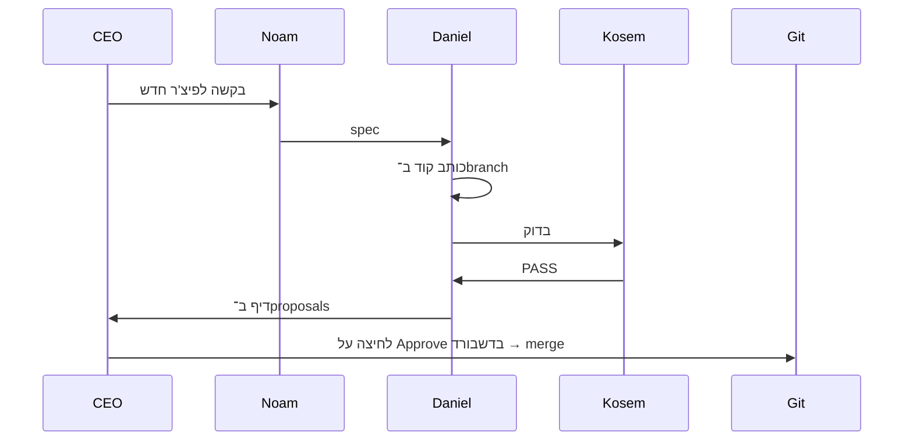

# Shefi & Co. v2.4 — חברת הסוכנים שלך

> **את ה־CEO. 15 סוכני AI עובדים בשבילך, מחולקים ל־3 חטיבות. עובדים מקבלים פורטל PWA אישי.**

מערכת עם:
- **בוט טלגרם** — הדלת לחטיבת התפעול
- **דשבורד CEO** ב־`/` — שיחת הסוכנים בזמן אמת + אישור דיפים + ניהול עובדים/ציוד/אירועים
- **פורטל עובדים (PWA)** ב־`/me` — בקשות ציוד, היסטוריה. אפליקציה אמיתית במסך הבית של הנייד.

## 3 חטיבות, 15 סוכנים

### חטיבת תפעול (העבודה היומיומית שלך)
| סוכן | תפקיד |
|------|-------|
| שפי | Chief of Staff — הדלת הקדמית בטלגרם |
| טובה | מנהלת משימות |
| מירה | מזכירה — דייג'סטים ותזכורות |
| איה | ארכיונאית — זיכרון סמנטי |
| שני | ספקים — חוזים, חשבוניות, חידושים |
| יעל | אירועים — ימי הולדת, חגים, גיבושים |
| מאיה | תקשורת פנימית — טיוטות מיילים והודעות |

### חטיבת פיתוח (בונה את שפי עצמה)
| סוכן | תפקיד |
|------|-------|
| נועם | Product Manager — מתרגם בקשות לספקים |
| דניאל | Developer — מממש קוד |
| קוסם | QA — בודק שהבילד לא נשבר |
| ליה | Designer — UX ו־UI |
| אורי | DevOps — מנטר את המערכת |
| רותם | Tech Writer — תיעוד |

### ידע ותובנות (Cross-cutting)
| סוכן | תפקיד |
|------|-------|
| אופיר | חוקר — חיפוש ברשת |
| אביב | אנליסט נתונים |

## איך להריץ

```bash
npm install
cd frontend && npm install && cd ..
npm run build
npm start
```

עכשיו:
- **טלגרם** — שלחי הודעה לבוט שלך, שפי תקלוט.
- **דשבורד** — פתחי `http://localhost:3000` בדפדפן ותראי את כל הסוכנים מדברים בזמן אמת.

## איך עובדת חטיבת הפיתוח



**בטיחות:** דניאל עובד תמיד ב־git branch נפרד (`feat/<id>`). הקוד לא נכנס ל־`main` עד שאת מאשרת בדשבורד.

## שימוש בדשבורד

- **Sidebar שמאלי** — רשימת כל הסוכנים. לחיצה על סוכן מסננת את הטיימליין רק אליו. נקודה ירוקה = פעיל בדקה האחרונה.
- **Timeline** — כל הודעה / קריאה לכלי / handoff בזמן אמת.
- **חיפוש** — שדה למעלה למעלה.
- **שורת קלט תחתית** — כתבי לשפי או לנועם ישירות.
- **פאנל ימני "ממתינים לאישור"** — דיפים מהצוות. כל אחד עם כפתור Approve / Reject.

## מבנה הפרויקט

```
src/
├── index.ts                     הפעלה: bot + scheduler + server
├── bot/                          telegram + voice
├── server/
│   ├── http.ts                   Fastify + REST + static
│   └── events.ts                 EventBus + agent_events table
├── agents/
│   ├── shefi.ts                  COS (entry, handoffs לכל חטיבת תפעול)
│   ├── tova.ts | mira.ts | aya.ts
│   ├── ops/                      shani, yael, maya
│   ├── dev/                      noam (PM), daniel, kosem, liya, uri, rotem
│   ├── knowledge/                ofir, aviv
│   ├── runner.ts                 instrumented Runner שפולט ל־eventBus
│   └── registry.ts               רשימת כל הסוכנים
├── dev/
│   ├── git.ts                    simple-git wrapper (branches, diffs, merge)
│   └── proposals.ts              CRUD על dev_tasks/proposals/approvals
├── db/                           schema.ts + client.ts (better-sqlite3)
├── scheduler/                    cron: דייג'סטים + תזכורות
└── lib/                          env, llm

frontend/
├── src/
│   ├── App.tsx                   ראשי
│   ├── components/               Sidebar, Timeline, ProposalsPanel, ChatBar
│   ├── api.ts                    REST + WebSocket client
│   └── utils.ts                  agent display + colors
└── (Vite + React + Tailwind)
```

## פרטיות

הכל מקומי. ה־DB ב־`data/shefi.db`, הדשבורד מאזין רק על `127.0.0.1`. רק ה־LLM יוצא החוצה ל־OpenAI.

הקוד הישן (v0) שמור ב־`archive/`.
